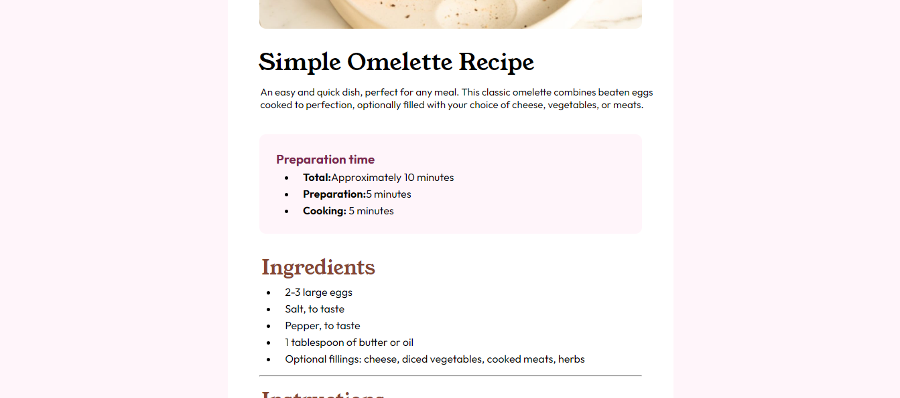

# Frontend Mentor - Recipe page solution

This is a solution to the [Recipe page challenge on Frontend Mentor](https://www.frontendmentor.io/challenges/recipe-page-KiTsR8QQKm). Frontend Mentor challenges help you improve your coding skills by building realistic projects. 

## Table of contents

- [Overview](#overview)
  - [The challenge](#the-challenge)
  - [Screenshot](#screenshot)
  - [Links](#links)
  - [Built with](#built-with)
  - [What I learned](#what-i-learned)
  - [Continued development](#continued-development)
- [Author](#author)


## Overview

### Screenshot




### Links

- Solution URL: [Add solution URL here](https://github.com/02-ahmed/recipe-page-main)
- Live Site URL: [Add live site URL here](https://your-live-site-url.com)


### Built with

- Semantic HTML5 markup
- CSS custom properties
- Flexbox
- CSS Grid


### What I learned

I learnt how to use hr tags and css grid

```html
  <div class="table">
    <div class="nutrient">Calories</div>
    <div class="value">277kcal</div>
  </div>
  <hr>
```
```css
.table {
  display: grid;
  grid-template-columns: repeat(2, 200px);
  margin-left: 35px;
  column-gap: 80px;
}
```

### Continued development

I'd like to learn how to write better media queries and how to use the mobile first workflow


## Author

- Website - [Ahmed Boabae](https://www.linkedin.com/in/ahmed-boabae-334a11256/)
- Frontend Mentor - [@02-ahmed](https://www.frontendmentor.io/profile/02-ahmed)
- Twitter - [@_02ahmed](https://twitter.com/_02ahmed)

